## Instalación servidor web Nginx
Para instalar el servidor nginx en Debian, primero actualizamos los repositorios y después instalamos el paquete correspondiente:

Actualizaremos con el siguiente comando: sudo apt update
Instalaremos el paquete con: sudo apt install nginx
Comprobamos que nginx se ha instalado y que está funcionando correctamente:
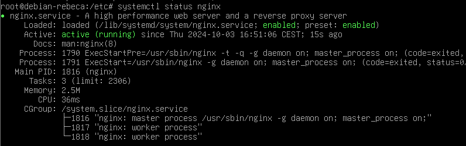

Crearemos la carpeta de nuestro sitio web o dominio:

Clonamos el siguiente repositorio:
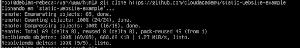 

Haremos que el propietario de esta carpeta y todo lo que haya dentro sea el usuario www-data, típicamente el usuario del servicio web.

Y le daremos los permisos adecuados para que no nos de un error de acceso no autorizado al entrar en el sitio web:
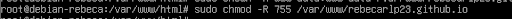

Comprobamos que funciona correctamente escribiendo esto:
http://IP-maq-virtual
Y debe salir esto:
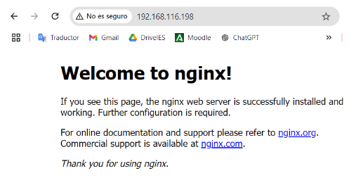

## Configuración de servidor web NGINX
Creamos el siguiente archivo:

Y de contenido escribimos lo siguiente:
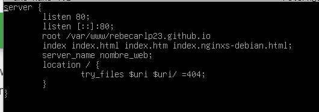
Y crearemos un archivo simbólico entre este archivo y el de sitios que están habilitados.
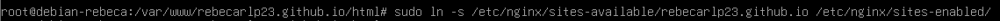
Una vez creado el archivo, reiniciamos nginx:

Configurar servidor SFTP en Debian
Primero instalaremos los repositorios:
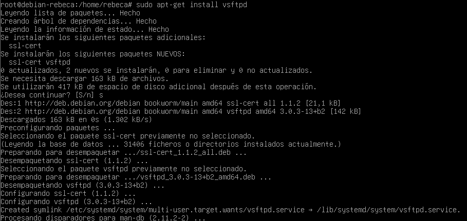
Ahora vamos a crear una carpeta en nuestro home:
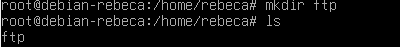

Ahora vamos a crear los certificados de seguridad necesarios para aportar la capa de cifrado a nuestra conexión 
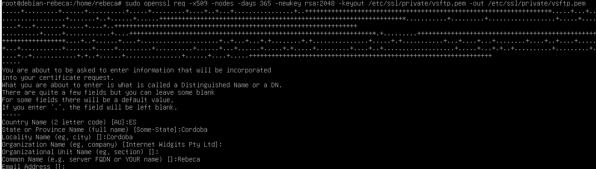

Ahora vamos a realizar la configuración de vsftpd. Se trata, con el editor de texto que más os guste, de editar el archivo de configuración de este servicio, por ejemplo con nano:
sudo nano /etc/vsftpd.conf
 Buscaremos las siguientes líneas del archivo y las eliminaremos:
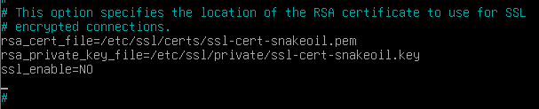

En su lugar añadiremos lo siguiente:
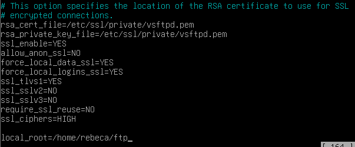

Guardamos y reiniciamos el servicio:
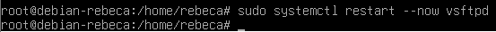

Tras acabar esta configuración, ya podremos acceder a nuestro servidor mediante un cliente FTP adecuado, como por ejemplo Filezilla
Descargamos el cliente FTP en nuestro ordenador.
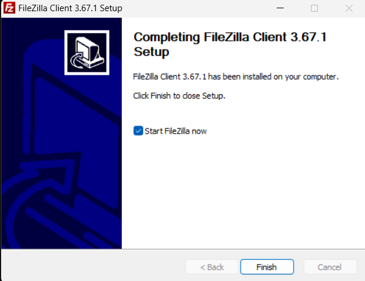

Introducimos los datos necesarios para conectarnos a nuestro servidor FTP en Debian:
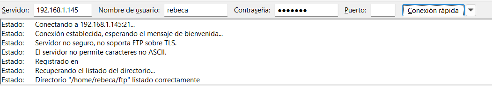

Nos conectaremos directamente a la carpeta que le habíamos indicado en el archivo de configuración /home/rebeca/ftp
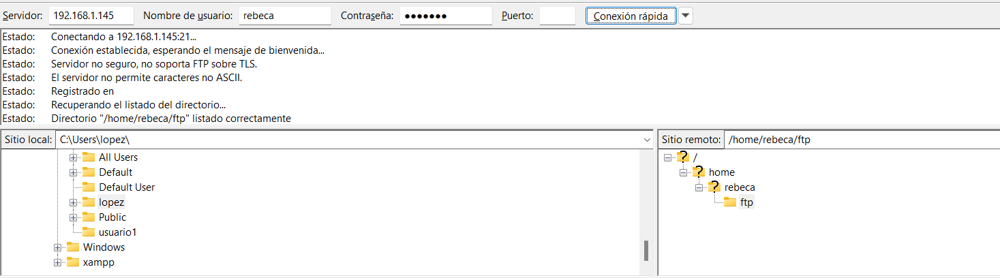

Una vez conectados, buscamos la carpeta de nuestro ordenador donde hemos descargado un archivo (en la parte izquierda de la pantalla) y en la parte derecha de la pantalla, buscamos la carpeta donde queremos subirla. 
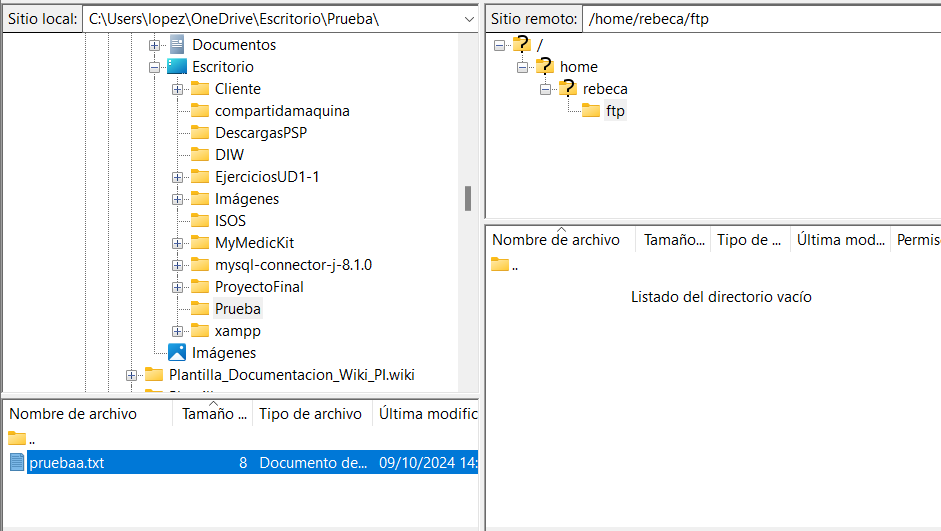

Con un doble click o utilizando botón derecho > subir, la subimos al servidor.
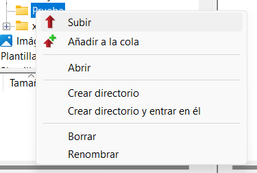

Vemos desde la consola que la transferencia ha sido correcta:
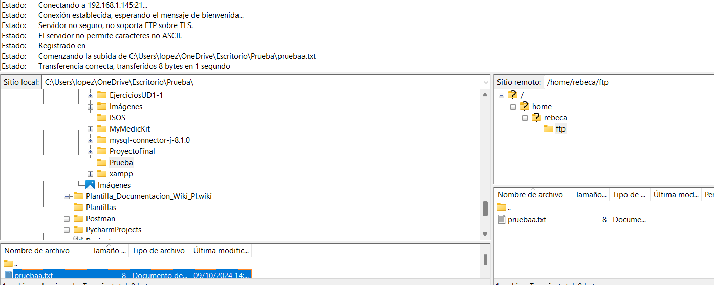

## Redirección HTTP a HTTPS
Ahora vamos a habilitar HTTPS en tu servidor y redirigir automáticamente las solicitudes HTTP a HTTPS.
Generaremos certificados SSL autofirmados que se utilizarán para habilitar HTTPS en tu servidor. Pondremos los siguientes comandos:
sudo mkdir /etc/ssl/private 
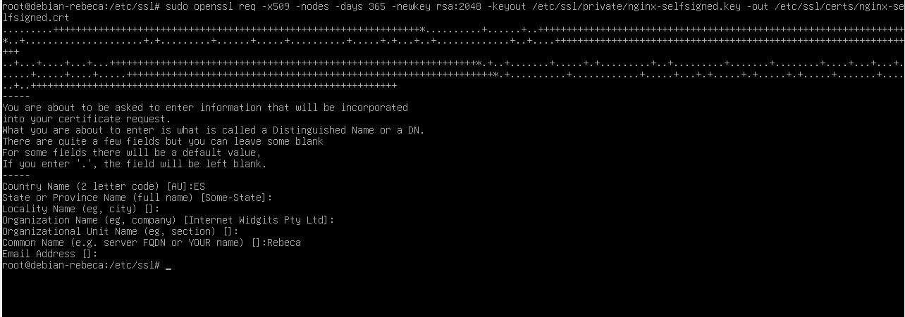

Creamos un archivo de parámetros Diffie-Hellman. Este archivo se usa para mejorar la seguridad de las conexiones SSL/TLS. Ejecútalo para generar el archivo:
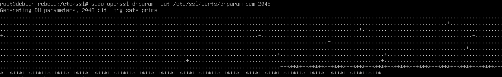

Configuramos Nginx para usar SSL. Ahora, necesitas editar el archivo de configuración de Nginx para habilitar HTTPS. Vamos a modificar el archivo de configuración del sitio web que creaste previamente en /etc/nginx/sites-available/nombre_web.

Modifica el archivo para incluir bloques de configuración para HTTPS:
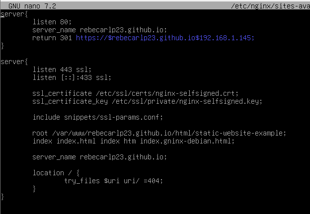

Y reiniciamos:
sudo systemctl restart nginx

Para comprobarlo accede al sitio web a través de http://nombre_web. Deberías ser redirigido automáticamente a https://nombre_web.:
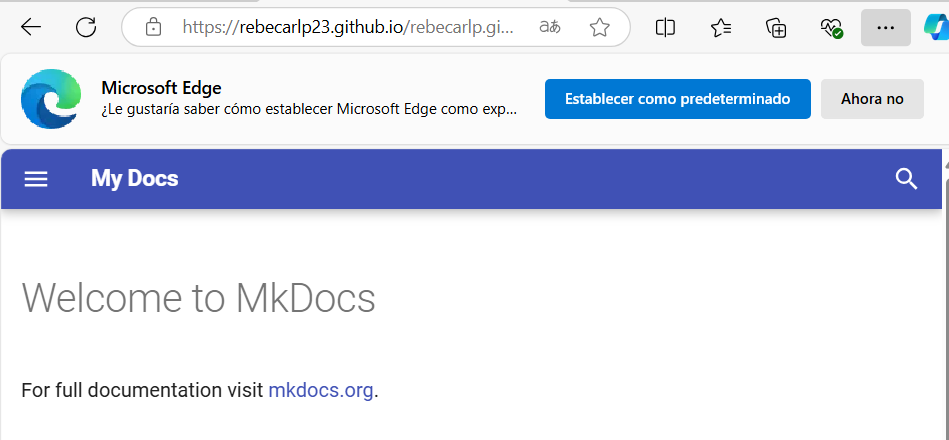
